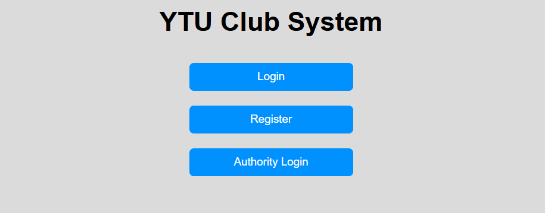
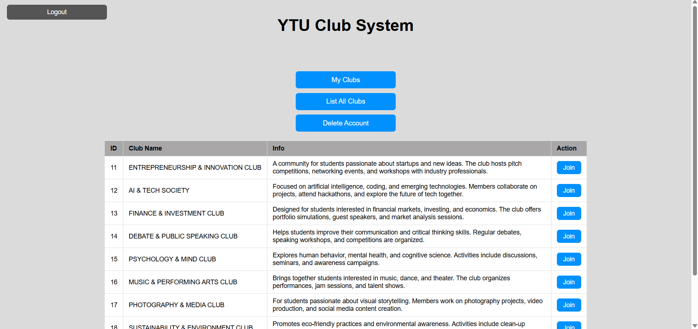
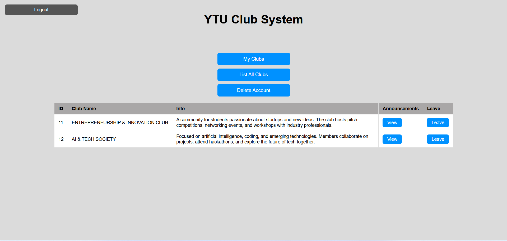
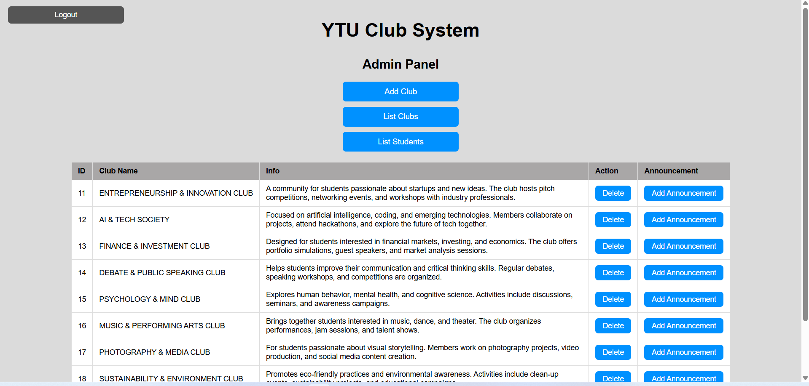
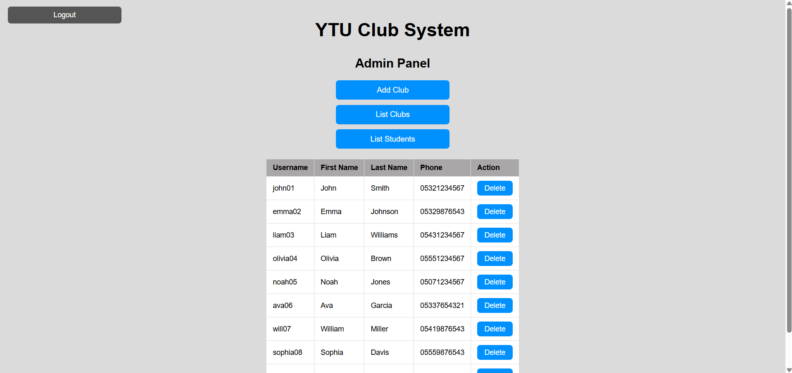
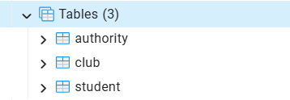
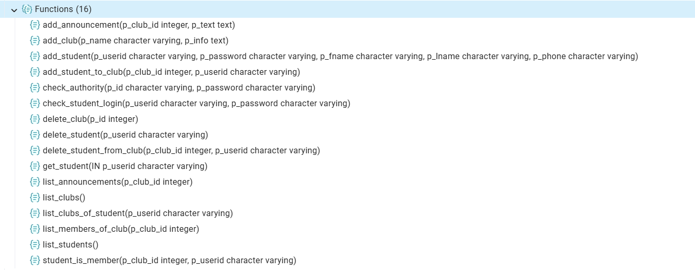
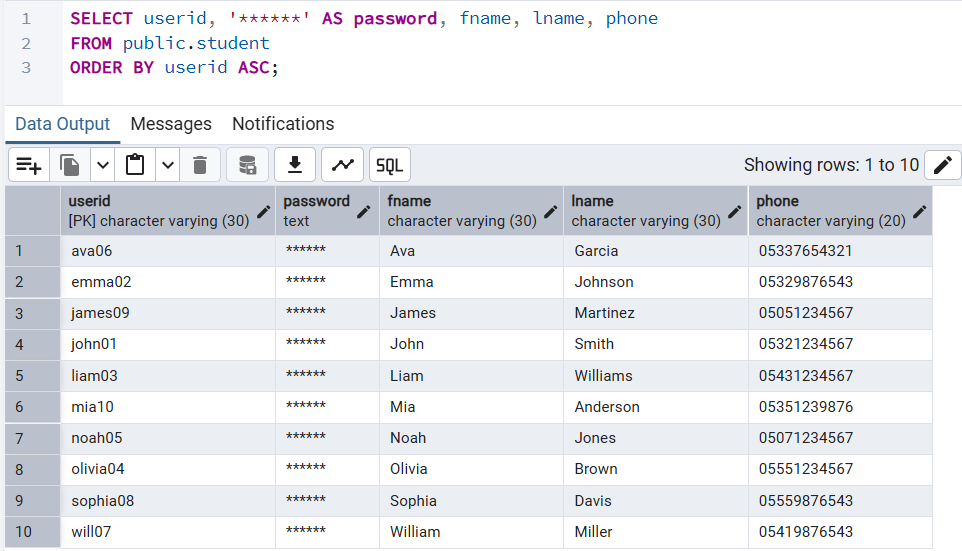

# 🎓 University Student Club Platform


A full-stack web application for managing university student clubs.  
Students can join clubs, view announcements, and manage their memberships, while authorities (admins) can manage clubs, students, and announcements.

---

## 📌 Features

### 👨‍🎓 Student
- Register & login
- View all clubs
- Join a club
- Leave a club
- View joined clubs
- View club announcements
- Delete own account

### 🛠️ Authority (Admin)
- Login as authority
- Add new clubs
- Delete clubs
- Add announcements to clubs
- List all clubs
- List all students
- Delete students

---

## 🏗️ Project Structure

```
University_Student_Club_Platform/
│
├── backend/        → Java (Spring Boot)
├── frontend/       → HTML, CSS, JavaScript
├── images/         → Screenshots
└── database.sql    → PostgreSQL schema & functions
```

---

## 🧠 Technologies Used

- Frontend: HTML, CSS, Vanilla JavaScript
- Backend: Java (Spring Boot)
- Database: PostgreSQL
- API: RESTful API

---

## 🖥️ User Interface

### Main Menu
The entry screen where users can choose to login, register, or access the authority panel.



---

### Student Panel – All Clubs
Students can browse all available clubs and join them.



---

### Student Panel – My Clubs
Students can see the clubs they joined, view announcements, or leave a club.



---

### Admin Panel – Club Management
Authorities can list, delete clubs, and add announcements.



---

### Admin Panel – Student Management
Authorities can view and delete student accounts.



---

## 🗄️ Database

### Tables
- `club`
- `student`
- `authority`



---

### Functions
PostgreSQL functions handle all core operations such as adding clubs, joining clubs, authentication, etc.



---

### Sample Student Data



---

## ⚙️ Setup & Run

### 1. Database

Install PostgreSQL and create a database (e.g. `clubdb`).

Run:

```
\i database.sql
```

---

### 2. Backend Configuration

Before running the backend, update:

```
backend/src/main/resources/application.properties
```

Edit according to your PostgreSQL setup:

```
spring.datasource.url=jdbc:postgresql://localhost:5432/clubdb
spring.datasource.username=YOUR_DB_USERNAME
spring.datasource.password=YOUR_DB_PASSWORD
```

> ⚠️ Replace with your own PostgreSQL credentials.

---

### 3. Backend

```
cd backend
./mvnw spring-boot:run
```

Backend runs at:
```
http://localhost:8080
```

---

### 4. Frontend

Open:

```
frontend/index.html
```

> Make sure the backend is running before using the frontend.

---

## 🔗 API

Base URL:
```
http://localhost:8080/api
```

---

## ⚠️ Notes

- Passwords are stored as plain text (for simplicity)
- Authentication is basic (no token/session system)
- Dynamic table structure is used per club

---

## 🚀 Future Improvements

- JWT authentication
- Password hashing (bcrypt)
- Role-based authorization
- UI improvements (React / Vue)
- Search & filtering
- Pagination
- Docker support
